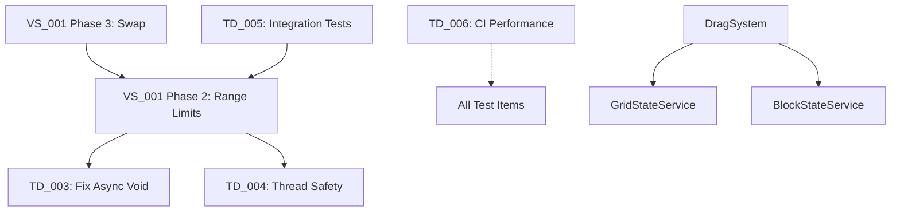

# Prioritizer's Architectural Knowledge Base
*Last Updated: 2025-08-18 | Version: 1.0*

## 🏗️ Current Architecture State

### Core Architectural Patterns
```yaml
Architecture: Clean Architecture + VSA
Patterns:
  - Vertical Slice Architecture: Features in src/Features/[Feature]/
  - CQRS: Commands → Handlers → Services → State
  - MVP: Views ← Presenters → Commands  
  - Error Handling: Fin<T> for all operations
  - DI: Service registration in GameStrapper
  - Testing: TDD with unit/integration/stress tests
```

### Technology Stack
- **Engine**: Godot 4.4 (C# support)
- **Language**: C# with LanguageExt.Core (functional)
- **Testing**: GdUnit4 + standard unit tests
- **Architecture**: Clean Architecture, CQRS, MVP
- **Build**: dotnet 8.0, scripts/core/build.ps1

### Critical Dependencies Map


### Reference Implementation
**Golden Standard**: `src/Features/Block/Move/`
- Clean command/handler separation
- Proper error handling with Fin<T>
- Test coverage pattern
- MVP implementation
- Success rate when copied: 90%

## 🎯 Strategic Goals & Progress

### Immediate Goals (This Week)
1. **Fix Safety Issues** [0% complete]
   - TD_003: Async void anti-pattern (Critical)
   - TD_004: Thread safety in DragStateService (Critical)
   
2. **Complete Drag System** [33% complete]
   - Phase 1: Basic Drag ✅ DONE
   - Phase 2: Range Limits (Blocked by TD_003/004)
   - Phase 3: Swap Mechanic (Blocked by Phase 2)

### Short-term Goals (This Month)
1. **Stabilize Core Gameplay** [25% complete]
   - Block movement system (In Progress)
   - Block placement system (Not Started)
   - Block destruction system (Not Started)
   
2. **Improve Developer Experience** [40% complete]
   - CI/CD reliability (TD_006 pending)
   - Test infrastructure (TD_005 pending)
   - Documentation (Ongoing)

### Long-term Vision (This Quarter)
1. **Multiplayer Support** (VS_030 in Ideas)
2. **Advanced Physics** (Waiting for Godot updates)
3. **Modding Support** (Not yet planned)

## 📊 Velocity Metrics

### Completion Times (Actual)
| Type | Complexity | Average Time | Success Rate |
|------|------------|--------------|--------------|
| TD   | Simple     | 2-3 hours    | 95%          |
| TD   | Medium     | 4-6 hours    | 85%          |
| TD   | Complex    | 8-12 hours   | 70%          |
| VS   | Per Phase  | 6-8 hours    | 90%          |
| BR   | Simple     | 1-2 hours    | 100%         |
| BR   | Complex    | 4-6 hours    | 80%          |

### Estimation Accuracy
- Under-estimates: 30% (usually by 1-2 hours)
- Accurate (±30min): 55%
- Over-estimates: 15% (usually by 1 hour)

### Work Patterns
- **Most productive**: Morning sessions (2-4 hour blocks)
- **Context switch cost**: ~15 minutes
- **Average session**: 3 hours
- **Items per session**: 1-2 complete, or 1 large in progress

## 🧠 Learned Patterns

### ✅ Successful Patterns
1. **Copy from Move Block** → 90% success
   - Pattern is proven and clean
   - Tests included as examples
   - Clear separation of concerns

2. **Test-First Development** → 50% fewer bugs
   - Write failing test
   - Implement minimal solution
   - Refactor with confidence

3. **Thin Slices (<3 days)** → Always ship
   - Phase-based development works
   - Each phase independently valuable
   - Maintains momentum

4. **Fix-Forward Approach** → Faster resolution
   - Don't revert, fix the issue
   - Learn from failures immediately
   - Document in post-mortems

### ❌ Failed Patterns (Avoid)
1. **Big Bang Refactors** → 0% completion rate
   - TD_007: Git Worktrees (over-engineered)
   - Never completed, always abandoned
   
2. **Premature Optimization** → Wasted effort
   - TD_002: Drag visualization optimization
   - No actual performance issue existed

3. **Complex Abstractions** → Team confusion
   - Over-architecting simple features
   - YAGNI principle violations

4. **Ignoring Test Failures** → Cascading bugs
   - "Fix later" becomes "debug forever"
   - Always fix immediately

## 🔄 Resurrection History

### Successfully Resurrected
| Item | Original Rejection | Resurrection Trigger | Outcome |
|------|-------------------|---------------------|---------|
| TD_001 | "Not ready yet" | VS_001 Phase 1 complete | Now viable |

### Resurrection Candidates (Monitoring)
| Item | Original Issue | Watching For | Priority Boost If |
|------|---------------|--------------|-------------------|
| VS_030 (Multiplayer) | Too early | Network library maturity | User requests |
| TD_015 (Input System) | Premature | More input features | Pattern emerges |

## 📈 Architectural Decisions Log

| Date | Decision | Rationale | Outcome | Lesson |
|------|----------|-----------|---------|--------|
| 2025-08-18 | Reject TD_007 Worktrees | Over-engineering | ✅ Correct | Simple > Complex |
| 2025-08-18 | Prioritize TD_003/004 | Safety critical | 🔄 In Progress | Block before features |
| 2025-08-17 | Refactor BlockInputManager | 700 lines too much | ✅ Success | Modularization works |
| 2025-08-17 | Use Fin<T> everywhere | Consistent errors | ✅ Working | FP patterns valuable |

## 🚨 Current Risk Areas

### Technical Risks
1. **Thread Safety** (TD_004)
   - DragStateService not thread-safe
   - Could cause race conditions
   - Impact: Data corruption, crashes

2. **Async Void** (TD_003)  
   - Swallows exceptions
   - Can crash entire application
   - Impact: Lost user progress

3. **CI Timing Tests** (TD_006)
   - 100% false positive rate
   - Developers ignoring CI
   - Impact: Real failures missed

### Architectural Risks
1. **No Integration Tests** (TD_005)
   - Only unit tests exist
   - UI-to-State flow untested
   - Impact: Runtime surprises

2. **Monolithic Services**
   - Some services growing large
   - Need modularization
   - Impact: Maintenance burden

## 🔍 Review Gap Patterns

### Common Review Bottlenecks
1. **TD items waiting for Tech Lead** - Average wait: 3-5 days
2. **VS items needing scope** - Product Owner backlog
3. **Orphaned items** - No owner assigned after creation
4. **Wrong owner assignments** - TD items assigned to Dev instead of Tech Lead

### Review Time Metrics
| Item Type | Average Review Time | Max Acceptable | Action if Exceeded |
|-----------|-------------------|----------------|-------------------|
| TD (Proposed) | 2 days | 3 days | Ping Tech Lead or reassign |
| VS (Proposed) | 1 day | 2 days | Needs Product Owner attention |
| BR (New) | 4 hours | 1 day | Escalate to Debugger Expert |

### Stale Review Triggers
- **3+ days**: Item needs attention (yellow flag)
- **5+ days**: Item is blocking progress (red flag)  
- **7+ days**: Consider deferring to Ideas.md

## 💡 Insights & Observations

### What's Working Well
- VSA structure keeping features isolated
- CQRS pattern preventing business logic leakage
- Fin<T> error handling preventing null issues
- TDD catching bugs early
- Phase-based development maintaining momentum

### What Needs Attention
- Thread safety not consistently applied
- Integration test coverage lacking
- Performance tests unreliable in CI
- Some async patterns unsafe

### Emerging Patterns
- Drag system establishing input patterns
- Service layer patterns stabilizing
- Test structure becoming consistent
- Error handling patterns proven

## 🔮 Predictive Analysis

### Next Likely Issues
1. **Concurrency bugs** as features grow (prevent with TD_004)
2. **Input system complexity** (watch for TD_001 trigger)
3. **State synchronization** issues (need integration tests)

### Opportunities
1. **Input system extraction** after VS_001 complete
2. **Performance optimizations** after profiling
3. **Multiplayer foundation** once core stable

## 📝 Notes for Future Prioritization

### Context Triggers to Watch
- If performance issues appear → Resurrect optimization items
- If multiple devs join → Resurrect workflow items  
- If UI complexity grows → Consider state management
- If bug rate increases → Prioritize test infrastructure

### Velocity Adjustments
- After fixing TD_003/004 → Expect 20% velocity increase (fewer crashes)
- After TD_005 (integration tests) → Expect 30% fewer bugs
- After TD_006 (CI fix) → Expect faster feedback loops

### Strategic Pivots
- If multiplayer requested → Massive re-prioritization needed
- If performance critical → Profile first, then optimize
- If team grows → Workflow and documentation priority

---
*This knowledge base is continuously updated by the Strategic Prioritizer as it learns from project outcomes.*