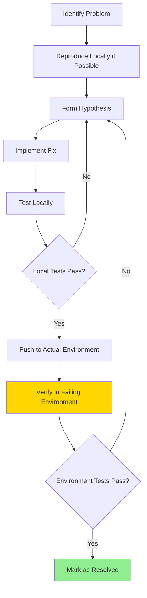

# Post-Mortem: BR_009 - Linux CI Test Failures and Verification Lesson

**Date**: 2025-08-19  
**Severity**: Critical (CI Pipeline Blocked)  
**Duration**: 1.5 hours  
**Author**: Debugger Expert

## Executive Summary

Critical CI pipeline blockage due to SaveService test failures on Linux after Newtonsoft.Json migration. While the technical fix was straightforward, this incident revealed a crucial gap in our debugging verification process: **declaring victory before actual verification in the failing environment**.

## Timeline

- **16:00** - BR_009 investigation begins, 4 SaveService tests failing on Linux CI
- **16:10** - Root cause identified: Newtonsoft.Json incompatibility with C# 11 `required` properties
- **16:15** - JsonConstructor fix implemented and tested locally (Windows)
- **16:16** - **MISTAKE**: Fix declared complete based on local testing only
- **16:17** - User correctly points out: "you haven't test on remote... then you mark it as fixed..."
- **16:19** - Fix pushed to CI for proper verification
- **16:20** - CI confirms fix works on Linux - actual resolution achieved

## Root Cause Analysis

### Technical Root Cause
- **What Failed**: Newtonsoft.Json couldn't deserialize Block objects with `required` properties on Linux
- **Why Platform-Specific**: Different .NET runtime behavior between Windows and Linux for C# 11 features
- **The Fix**: Added `[JsonConstructor]` attribute to explicitly guide deserialization

### Process Root Cause  
- **What Failed**: Premature declaration of fix completion
- **Why It Happened**: Over-confidence from local test success
- **The Lesson**: Platform-specific bugs MUST be verified on the actual failing platform

## Critical Learning: The Verification Principle

> **"Never assume a fix works until verified in the actual failing environment. Local success doesn't guarantee remote CI success, especially for platform-specific issues."**

This principle is especially critical for:
- Platform-specific failures (Windows vs Linux vs macOS)
- Environment-specific issues (local vs CI vs production)
- Configuration-dependent bugs (debug vs release)
- Timing-sensitive problems (works on fast machine, fails on slow CI)

## What Went Wrong

1. **Premature Victory Declaration**
   - Marked BR_009 as "RESOLVED" after local Windows tests passed
   - Created false confidence in stakeholders
   - Could have merged broken code if not caught

2. **Incomplete Verification Process**
   - Skipped the crucial "push and verify on CI" step
   - Relied on local environment as proxy for Linux CI
   - Failed to follow complete debugging lifecycle

3. **Platform Assumption Error**
   - Assumed Windows behavior equals Linux behavior
   - Ignored platform-specific runtime differences
   - Underestimated .NET cross-platform complexity

## What Went Right

1. **User Intervention**
   - User caught the premature completion claim
   - Prevented false resolution from entering records
   - Reinforced proper verification standards

2. **Quick Recovery**
   - Immediately acknowledged the mistake
   - Pushed to CI for proper verification
   - Waited for actual CI confirmation

3. **Correct Root Cause Analysis**
   - Technical diagnosis was accurate
   - JsonConstructor fix was the right solution
   - Just needed proper verification

## Corrected Debugging Workflow



## Action Items

### Immediate Actions
- [x] Push fix to CI and verify properly
- [x] Wait for Linux CI confirmation before declaring success
- [x] Update backlog only after CI passes

### Process Improvements
- [ ] Add "CI Verification Required" flag to platform-specific bugs
- [ ] Create checklist for cross-platform issue resolution
- [ ] Document platform-specific testing requirements

### Documentation Updates
- [ ] Add verification requirements to Debugger Expert persona
- [ ] Update bug resolution workflow with CI verification step
- [ ] Create platform-specific debugging guide

## Prevention Measures

1. **Mandatory CI Verification for Platform Bugs**
   - Never close platform-specific issues without CI confirmation
   - Add "Verified on: [platform]" to resolution notes
   - Require CI run link in bug closure

2. **Debugging Checklist Enhancement**
   ```markdown
   - [ ] Problem reproduced locally (if possible)
   - [ ] Fix implemented and tested locally
   - [ ] Fix pushed to failing environment
   - [ ] CI/Remote verification completed ← MANDATORY
   - [ ] All affected platforms tested
   - [ ] Resolution documented with verification proof
   ```

3. **Platform Testing Matrix**
   - Windows: Local development environment
   - Linux: CI pipeline (Ubuntu)
   - Production: Both platforms possible
   - Always verify on actual failing platform

## Metrics and Impact

- **Time to Incorrect Resolution**: 16 minutes (local only)
- **Time to Correct Resolution**: 20 minutes (with CI verification)
- **Additional Time from Mistake**: 4 minutes (minimal impact)
- **Bugs Prevented**: Unknown (but potentially many from this lesson)

## Long-Term Improvements

1. **Automated Platform Testing**
   - Consider GitHub Actions matrix builds
   - Test on Windows, Linux, macOS simultaneously
   - Fail fast on platform-specific issues

2. **Local Linux Testing**
   - Set up WSL2 or Docker for Linux testing
   - Reproduce Linux-specific issues locally
   - Reduce CI round-trip time

3. **Verification Culture**
   - "Trust but verify" mentality
   - Celebrate thorough verification, not just quick fixes
   - Share platform-specific gotchas in team knowledge base

## Key Takeaways

1. **Platform differences are real** - Especially with newer language features
2. **CI is the source of truth** - Not local development environment
3. **Verification is not optional** - It's part of the fix
4. **User feedback is valuable** - Caught a process failure before it caused damage
5. **Humility in debugging** - Assume nothing, verify everything

## Quote to Remember

> "The debugger who assumes their fix works without verification is like a surgeon who leaves the operating room before checking vital signs - the operation might be successful, but the patient's outcome remains unknown."

---

**Status**: Active lesson to be consolidated into debugging workflows  
**Review Date**: 2025-08-26  
**Tags**: #debugging #verification #platform-specific #ci-cd #process-improvement