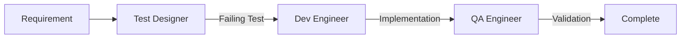
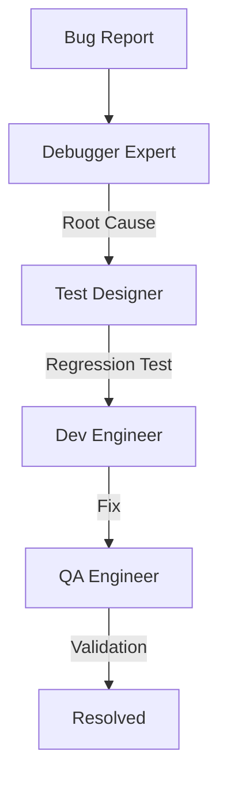
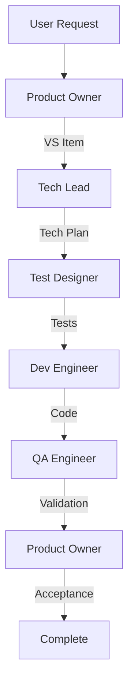
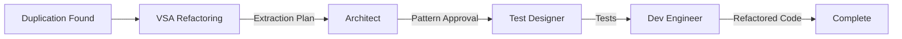
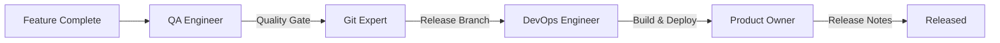

# Agent Integration Patterns

## Purpose
This document defines proven patterns for integrating multiple agents to accomplish complex workflows in the BlockLife ecosystem.

---

## 🎯 Core Integration Patterns

### Pattern 1: TDD Workflow Integration
**Agents**: Test Designer → Dev Engineer → QA Engineer
**Purpose**: Complete Test-Driven Development cycle



**Integration Flow**:
1. **Test Designer** receives requirement, creates failing test
2. **Dev Engineer** receives test, implements minimal code
3. **QA Engineer** receives implementation, validates quality
4. **Backlog Maintainer** updates progress at each step

**Context Propagation**:
```yaml
test_designer_output:
  test_file: path/to/test.cs
  test_method: TestMethodName
  assertions: [what's being tested]
  
dev_engineer_input:
  inherit: test_designer_output
  add:
    implementation_target: path/to/implement.cs
    pattern_reference: src/Features/Block/Move/

qa_engineer_input:
  inherit: dev_engineer_output
  add:
    test_results: dotnet test output
    coverage_report: path/to/coverage
```

---

### Pattern 2: Bug Resolution Integration
**Agents**: Debugger Expert → Test Designer → Dev Engineer → QA Engineer
**Purpose**: Fix bug with permanent regression prevention



**Integration Flow**:
1. **Debugger Expert** diagnoses root cause
2. **Test Designer** creates regression test
3. **Dev Engineer** implements fix
4. **QA Engineer** validates fix and no side effects

**Key Integration Points**:
- Debugger output becomes test specification
- Test drives the fix implementation
- QA validates both fix and prevention

---

### Pattern 3: Feature Development Integration
**Agents**: Product Owner → Tech Lead → Test Designer → Dev Engineer → QA Engineer
**Purpose**: Full vertical slice implementation



**Phased Integration**:
```yaml
phase_1_planning:
  agents: [product-owner, tech-lead]
  outputs: [VS_item, technical_plan]
  
phase_2_implementation:
  agents: [test-designer, dev-engineer]
  outputs: [tests, implementation]
  
phase_3_validation:
  agents: [qa-engineer, product-owner]
  outputs: [quality_report, acceptance]
```

---

### Pattern 4: Refactoring Integration
**Agents**: VSA Refactoring → Architect → Test Designer → Dev Engineer
**Purpose**: Extract shared code while maintaining architecture



**Integration Safeguards**:
- Architect validates extraction doesn't violate boundaries
- Tests ensure behavior preservation
- VSA Refactoring validates final structure

---

### Pattern 5: Release Integration
**Agents**: QA Engineer → Git Expert → DevOps Engineer → Product Owner
**Purpose**: Coordinated release process



**Coordination Points**:
- QA must pass before release branch
- Git Expert creates clean history
- DevOps automates deployment
- PO communicates release

---

## 🔄 Complex Integration Patterns

### Pattern 6: Concurrent Development Integration
**Agents**: Multiple Dev Engineers + Git Expert + QA Engineer
**Purpose**: Parallel feature development

```yaml
parallel_tracks:
  track_1:
    branch: feat/feature-a
    agents: [test-designer-1, dev-engineer-1]
    
  track_2:
    branch: feat/feature-b
    agents: [test-designer-2, dev-engineer-2]
    
  integration:
    agent: git-expert
    action: merge_without_conflicts
    
  validation:
    agent: qa-engineer
    action: integration_test_suite
```

**Conflict Resolution**:
1. Git Expert handles merge conflicts
2. QA validates integration
3. Debugger assists if integration fails

---

### Pattern 7: Performance Optimization Integration
**Agents**: QA Engineer → Debugger Expert → Architect → Dev Engineer
**Purpose**: Systematic performance improvement

```yaml
performance_workflow:
  measure:
    agent: qa-engineer
    output: benchmarks
    
  analyze:
    agent: debugger-expert
    input: benchmarks
    output: bottlenecks
    
  design:
    agent: architect
    input: bottlenecks
    output: optimization_strategy
    
  implement:
    agent: dev-engineer
    input: optimization_strategy
    output: optimized_code
    
  validate:
    agent: qa-engineer
    input: optimized_code
    output: improved_benchmarks
```

---

## 📊 Integration Success Metrics

### Measuring Integration Quality

| Metric | Good | Poor | Improvement |
|--------|------|------|------------|
| Hand-off Time | < 1 min | > 5 min | Standardize formats |
| Context Loss | 0% | > 10% | Better propagation |
| Rework Rate | < 5% | > 20% | Clearer boundaries |
| Cycle Time | Predictable | Variable | Optimize flow |

### Integration Health Indicators

**Healthy Integration**:
- ✅ Each agent completes in one pass
- ✅ No context clarification needed
- ✅ Outputs directly usable by next agent
- ✅ Progress visible throughout

**Unhealthy Integration**:
- ❌ Multiple back-and-forth cycles
- ❌ Agents blocked waiting for info
- ❌ Output requires transformation
- ❌ Progress unclear or stuck

---

## 🎮 Integration Orchestration Rules

### Rule 1: Maintain Integration Context
```python
integration_context = {
    'workflow_id': 'unique_id',
    'work_item': 'VS_XXX',
    'current_phase': 'implementation',
    'completed_agents': ['product-owner', 'tech-lead'],
    'pending_agents': ['test-designer', 'dev-engineer'],
    'accumulated_outputs': {...},
    'decisions_made': [...]
}
```

### Rule 2: Handle Integration Failures
```python
if agent_failure:
    if recoverable:
        retry_with_context_adjustment()
    else:
        escalate_to_human()
        document_failure_mode()
        provide_manual_workaround()
```

### Rule 3: Optimize Integration Paths
- Parallelize independent agents
- Serialize dependent agents
- Cache common contexts
- Reuse successful patterns

---

## 🔧 Integration Anti-Patterns to Avoid

### Anti-Pattern 1: Circular Dependencies
**Problem**: Agent A needs B's output, B needs A's output
**Solution**: Break cycle with intermediate state

### Anti-Pattern 2: Context Explosion
**Problem**: Each agent adds context, growing exponentially
**Solution**: Filter and summarize at boundaries

### Anti-Pattern 3: Silent Failures
**Problem**: Integration fails but continues anyway
**Solution**: Explicit failure handling and alerts

### Anti-Pattern 4: Tight Coupling
**Problem**: Agents depend on internal details of others
**Solution**: Define clear interfaces and contracts

---

## 🚀 Advanced Integration Techniques

### Technique 1: Pipeline Composition
Chain simple integrations into complex workflows:
```
Simple: A → B
Composed: (A → B) + (C → D) = A → B → C → D
```

### Technique 2: Conditional Routing
Route to different agents based on conditions:
```python
if test_complexity > threshold:
    route_to('architect')  # Need design help
else:
    route_to('dev-engineer')  # Standard implementation
```

### Technique 3: Batch Processing
Process multiple items through same integration:
```python
for work_item in backlog:
    run_integration_pattern(work_item)
    track_progress(work_item)
```

### Technique 4: Integration Caching
Reuse integration results when applicable:
```python
if similar_pattern_exists(current_request):
    reuse_pattern_result()
else:
    run_full_integration()
    cache_pattern_result()
```

---

## 📝 Integration Best Practices

1. **Start Simple**: Begin with two-agent integrations, then compose
2. **Document Interfaces**: Clear inputs/outputs for each agent
3. **Test Integration Paths**: Verify hand-offs work correctly
4. **Monitor Integration Health**: Track metrics and improve
5. **Evolve Patterns**: Refine based on actual usage
6. **Handle Edge Cases**: Plan for failures and exceptions
7. **Maintain Flexibility**: Allow manual override when needed

---

## 🔍 Debugging Integration Issues

### Common Issues and Solutions

| Issue | Symptoms | Solution |
|-------|----------|----------|
| Lost Context | Next agent asks for info | Improve propagation |
| Wrong Agent | Unexpected behavior | Fix routing logic |
| Stuck Workflow | No progress | Add timeouts |
| Conflicting Outputs | Contradictory results | Clarify boundaries |
| Performance Degradation | Slow integration | Optimize critical path |

### Integration Debugging Checklist
- [ ] Check agent availability
- [ ] Verify context completeness
- [ ] Review routing decisions
- [ ] Examine output formats
- [ ] Test error handling
- [ ] Validate success criteria

---

**Last Updated**: 2025-08-16
**Maintained By**: Tech Lead Agent
**Next Review**: After first complex integration implementation