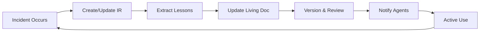
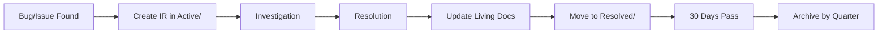

# Living Document Post-Mortem Framework

**Version**: 1.0  
**Status**: Active Framework  
**Created**: 2025-08-15  
**Owner**: Tech Lead Agent

## Executive Summary

This framework establishes a dual-track documentation system that separates evolving strategic wisdom from historical incident records, ensuring knowledge continuously improves while maintaining a complete audit trail.

## Core Philosophy

**Living Documents**: Strategic playbooks that evolve as we learn more  
**Incident Reports**: Point-in-time records for historical reference  
**Principle**: Wisdom grows, incidents are archived

## 1. Document Classification System

### Living Wisdom Documents (LWD)
Strategic documents that evolve with every relevant incident or learning experience.

**Characteristics**:
- Continuously updated with new insights
- Version controlled with change history
- Agent-owned and maintained
- Referenced by multiple workflows
- Contains actionable patterns and playbooks

### Incident Reports (IR)
Historical records of specific bugs, failures, or events.

**Characteristics**:
- Immutable once closed
- Point-in-time snapshot
- Links to Living Documents affected
- Archived after resolution
- Contains forensic details

## 2. Folder Structure & Naming Conventions

```
Docs/
├── Living-Wisdom/                     # Strategic evolving documents
│   ├── Playbooks/                     # Agent-owned operational guides
│   │   ├── LWP_001_Stress_Testing_Playbook.md        (QA Engineer)
│   │   ├── LWP_002_Integration_Testing_Patterns.md   (Architect)
│   │   ├── LWP_003_Notification_Debugging_Guide.md   (Debugger Expert)
│   │   ├── LWP_004_Production_Readiness_Checklist.md (Tech Lead)
│   │   └── LWP_005_Thread_Safety_Patterns.md         (Architect)
│   │
│   ├── Architecture-Patterns/         # Proven architectural solutions
│   │   ├── LAP_001_State_Management_Patterns.md
│   │   ├── LAP_002_CQRS_Error_Handling.md
│   │   └── LAP_003_DI_Registration_Patterns.md
│   │
│   ├── Troubleshooting/               # Diagnostic procedures
│   │   ├── LTG_001_Race_Condition_Detection.md
│   │   ├── LTG_002_Memory_Leak_Investigation.md
│   │   └── LTG_003_Deadlock_Analysis.md
│   │
│   └── index.md                       # Master index of all living documents
│
├── Incident-Reports/                  # Historical bug/incident records
│   ├── Active/                        # Currently being investigated
│   │   └── IR_XXX_[Brief_Description].md
│   │
│   ├── Resolved/                      # Closed incidents (last 30 days)
│   │   └── IR_XXX_[Brief_Description].md
│   │
│   └── Archive/                       # Historical archive
│       ├── 2025-Q1/
│       └── 2025-Q2/
│
└── Shared/
    └── Post-Mortems/                  # DEPRECATED - migrate to new structure
```

### Naming Conventions

**Living Wisdom Documents**:
- Format: `[PREFIX]_[NUMBER]_[Descriptive_Name].md`
- Prefixes:
  - `LWP` - Living Wisdom Playbook
  - `LAP` - Living Architecture Pattern
  - `LTG` - Living Troubleshooting Guide
- Example: `LWP_001_Stress_Testing_Playbook.md`

**Incident Reports**:
- Format: `IR_[YYYY][MM][DD]_[NUMBER]_[Brief_Description].md`
- Example: `IR_20250815_001_BlockId_Stability_Issue.md`

## 3. Document Lifecycle Workflows

### Living Document Lifecycle



**Creation**:
1. Identify need for strategic guidance
2. Agent creates initial document from template
3. Populate with initial patterns/procedures
4. Register in index.md
5. Link from relevant workflows

**Evolution**:
1. Incident provides new insight
2. Agent reviews relevant living documents
3. Updates document with new patterns
4. Increments version number
5. Documents change in revision history
6. Notifies dependent agents

**Archival**:
- Living documents are NEVER archived
- They may be deprecated with forwarding references
- Historical versions preserved in Git history

### Incident Report Lifecycle



**Creation**:
1. Bug/incident discovered
2. Create IR in Active/ folder
3. Follow bug-to-test protocol
4. Document investigation findings

**Resolution**:
1. Fix implemented and verified
2. Extract lessons learned
3. Update relevant living documents
4. Move IR to Resolved/ folder
5. Link IR to updated living docs

**Archival**:
1. After 30 days in Resolved/
2. Move to Archive/[YYYY-QN]/
3. Maintain links to living documents

## 4. Agent Ownership Model

### Primary Document Owners

| Agent | Living Documents | Responsibilities |
|-------|-----------------|------------------|
| **QA Engineer** | LWP_001_Stress_Testing_Playbook | Maintain stress testing procedures, update with new test scenarios |
| **Architect** | LWP_002_Integration_Testing_Patterns<br>LAP_*_Architecture_Patterns | Own architectural patterns, integration strategies |
| **Debugger Expert** | LWP_003_Notification_Debugging_Guide<br>LTG_*_Troubleshooting_Guides | Maintain debugging procedures, diagnostic techniques |
| **Tech Lead** | LWP_004_Production_Readiness_Checklist | Own production criteria, quality gates |
| **Dev Engineer** | LAP_002_CQRS_Error_Handling | Maintain implementation patterns |

### Collaboration Model

**Cross-Agent Updates**:
1. Any agent can suggest updates via comments
2. Owner agent reviews and integrates changes
3. Major changes require owner approval
4. Emergency updates allowed with notification

**Review Triggers**:
- After every critical incident (HF_*)
- Weekly for active playbooks
- When referenced patterns fail
- On request from other agents

## 5. Migration Plan for Existing Files

### Phase 1: Classification (Immediate)

**Documents to become Living Wisdom**:
1. `Architecture_Stress_Testing_Lessons_Learned.md` → `LWP_001_Stress_Testing_Playbook.md`
2. `Integration_Test_Architecture_Deep_Dive.md` → `LWP_002_Integration_Testing_Patterns.md`
3. `Debugging_Notification_Pipeline.md` (from Guides) → `LWP_003_Notification_Debugging_Guide.md`
4. `Critical_Architecture_Fixes_Post_Mortem.md` → `LWP_004_Production_Readiness_Checklist.md`

**Documents to become Incident Reports**:
- All specific bug reports (BlockId_Stability, DI_Container, etc.)
- Move to Incident-Reports/Archive/2025-Q1/

### Phase 2: Consolidation (Day 1-2)

1. **Extract Patterns** from incident reports
2. **Merge Duplicates** (e.g., multiple notification bugs)
3. **Create Cross-References** between IR and LWD
4. **Update CLAUDE.md** references

### Phase 3: Activation (Day 3)

1. **Update Agent Workflows** to reference new structure
2. **Create Agent Triggers** for document maintenance
3. **Archive Old Structure** to `_deprecated/`
4. **Announce Framework** activation

## 6. Template Structures

### Living Wisdom Document Template

```markdown
# [Document Title]

**Document ID**: [LWP/LAP/LTG]_XXX  
**Version**: X.Y  
**Last Updated**: YYYY-MM-DD  
**Owner**: [Agent Name]  
**Status**: Active/Under Review/Deprecated

## Purpose
[Why this document exists and what problems it solves]

## Quick Reference
[Checklist or decision tree for common scenarios]

## Core Patterns

### Pattern 1: [Name]
**When to Use**: [Criteria]
**Implementation**: [Code/Steps]
**Validation**: [How to verify]

## Common Pitfalls
1. [Pitfall]: [How to avoid]

## Troubleshooting Guide
[Step-by-step diagnostic procedures]

## Related Documents
- Links to other living documents
- Related incident reports that shaped this

## Revision History
| Version | Date | Changes | Triggered By |
|---------|------|---------|--------------|
| 1.0 | YYYY-MM-DD | Initial creation | IR_XXX |
| 1.1 | YYYY-MM-DD | Added Pattern X | IR_YYY |
```

### Incident Report Template

```markdown
# Incident Report: [Brief Description]

**Report ID**: IR_YYYYMMDD_XXX  
**Date**: YYYY-MM-DD  
**Severity**: Critical/High/Medium/Low  
**Status**: Active/Resolved/Archived

## Executive Summary
[One paragraph overview]

## Incident Details
- **Discovery**: [How found]
- **Impact**: [What broke]
- **Root Cause**: [Why it happened]

## Investigation
[Forensic details, logs, reproduction steps]

## Resolution
- **Fix Applied**: [What was changed]
- **Verification**: [How verified]
- **Regression Test**: [Test added]

## Lessons Learned
[Key insights extracted]

## Living Documents Updated
- [ ] LWP_XXX - [Specific update made]
- [ ] LAP_YYY - [Pattern added/modified]

## Prevention Measures
[What will prevent recurrence]
```

## 7. Integration Points

### With Bug-to-Test Protocol
1. Bug discovered → Create IR
2. Write regression test per protocol
3. Fix and verify
4. Update relevant LWD with prevention pattern
5. Archive IR after 30 days

### With Agent Workflows
```python
# Agent trigger for living document update
def update_living_document(incident_id, lessons_learned):
    trigger_agent(
        document_owner,
        "update_living_wisdom",
        {
            "incident": incident_id,
            "lessons": lessons_learned,
            "affected_patterns": [...]
        }
    )
```

### With CI/CD Pipeline
- Living documents referenced in quality gates
- Production readiness checklist enforced
- Stress testing playbook executed automatically

## 8. Success Metrics

**Living Document Health**:
- Update frequency (target: weekly for active docs)
- Cross-references per document (target: 3+)
- Agent utilization rate (target: 80%+)

**Incident Resolution Efficiency**:
- Time to resolution (trending down)
- Lessons extracted per incident (target: 2+)
- Recurrence rate (target: <5%)

## 9. Implementation Checklist

### Immediate Actions (Day 0)
- [ ] Create folder structure
- [ ] Migrate first 4 critical living documents
- [ ] Update CLAUDE.md with new structure
- [ ] Create index.md for living documents

### Day 1 Actions
- [ ] Classify all 17 existing post-mortems
- [ ] Create incident reports for bug-specific files
- [ ] Extract patterns into living documents
- [ ] Assign agent ownership

### Day 2 Actions
- [ ] Update agent workflow files
- [ ] Create cross-references
- [ ] Archive deprecated structure
- [ ] Test agent triggers

### Day 3 Actions
- [ ] Activate framework
- [ ] Run first update cycle
- [ ] Validate agent compliance
- [ ] Document any issues

## 10. Maintenance Schedule

**Daily**: New incidents create/update documents  
**Weekly**: Owners review their living documents  
**Monthly**: Archive resolved incidents older than 30 days  
**Quarterly**: Framework effectiveness review

## Appendix: Quick Decision Tree

```
Is this a specific bug/incident?
├─ Yes → Create Incident Report (IR_*)
│   └─ After resolution → Update Living Documents
└─ No → Is this a reusable pattern/lesson?
    ├─ Yes → Update/Create Living Document (LW*)
    └─ No → Consider if documentation needed
```

---

**Framework Activation**: Upon approval, this framework supersedes all previous post-mortem handling procedures.